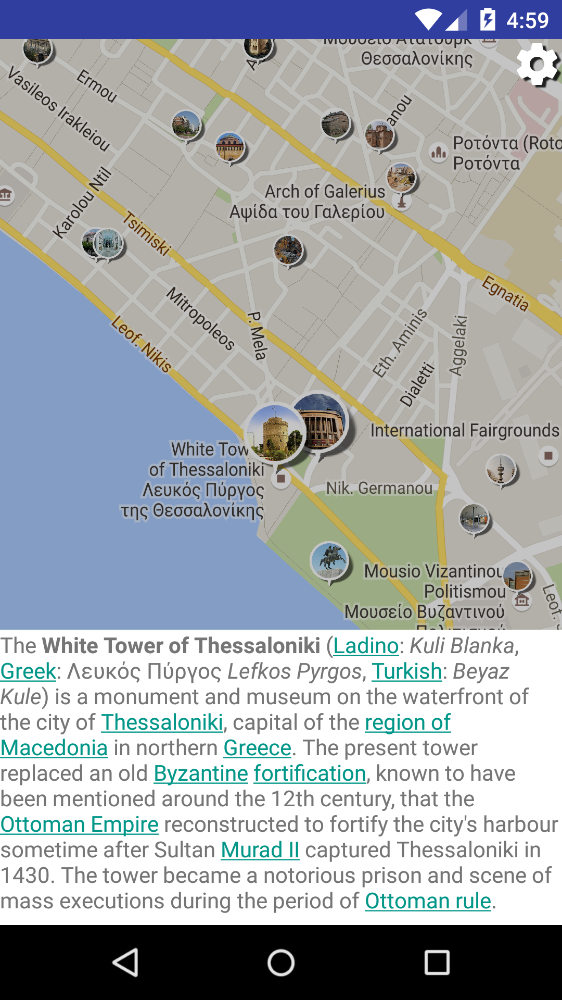
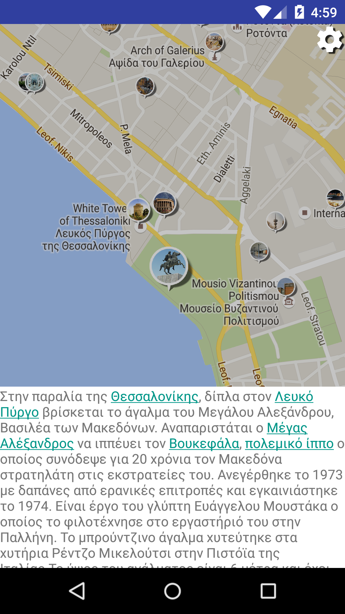
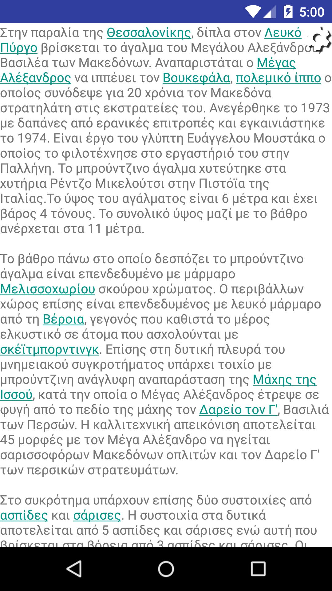
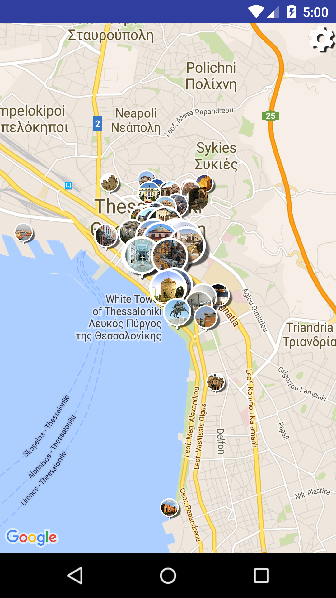

# GoToo
*Thess App Tourism edition - Apps4Thessaloniki*

Το **Go Too** ειναι μια καινοτόμα εφαρμογή για κινητά με λειτουργικό σύστημα Android που στηρίζεται στoν συνδυασμό της πληρότητας και της εγκυρότητας της [wikipedia] (https://en.wikipedia.org/wiki/Main_Page) με την ολιστική παρουσίαση που προσφέρουν οι χάρτες των [google maps] (https://www.google.com/maps) στα έξυπνα κινητά.

Για να γινει εγκατάσταση της εφαρμογής :

1. Μεταφορά του αρχειου που βρισκεται στον καταλογο apk , στη συσκευή.
2. Βρείτε το αρχειο αυτό με χρηση καποιου File Manager στη συσκευή σας.
3. Click 
4. Ανοιγει ενα pop up παραθυρο με επιλογές 
5. Επιλέξτε εγκατάσταση


### Screenshots








### License


```
Copyright 2015 

Licensed to the Apache Software Foundation (ASF) under one or more contributor
license agreements. See the NOTICE file distributed with this work for
additional information regarding copyright ownership. The ASF licenses this
file to you under the Apache License, Version 2.0 (the "License"); you may not
use this file except in compliance with the License. You may obtain a copy of
the License at

http://www.apache.org/licenses/LICENSE-2.0

Unless required by applicable law or agreed to in writing, software
distributed under the License is distributed on an "AS IS" BASIS, WITHOUT
WARRANTIES OR CONDITIONS OF ANY KIND, either express or implied. See the
License for the specific language governing permissions and limitations under
the License.
```
